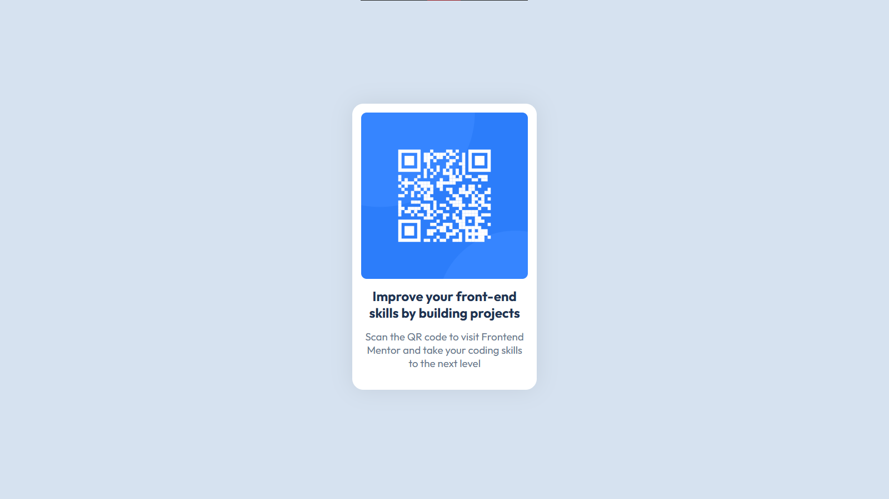

# Frontend Mentor - QR code component solution

This is a solution to the [QR code component challenge on Frontend Mentor](https://www.frontendmentor.io/challenges/qr-code-component-iux_sIO_H). Frontend Mentor challenges help you improve your coding skills by building realistic projects. 

## Table of contents

- [Overview](#overview)
  - [Screenshot](#screenshot)
  - [Links](#links)
- [My process](#my-process)
  - [Built with](#built-with)
  - [What I learned](#what-i-learned)
  - [Continued development](#continued-development)
  - [AI Collaboration](#ai-collaboration)
- [Author](#author)

## Overview
The getting-started path challenge of Frontend Mentor. The website was the easy part, but the git was the stressful part.

### Screenshot



### Links

- Solution URL: (https://www.frontendmentor.io/learning-paths/getting-started-on-frontend-mentor-XJhRWRREZd/challenge/65e6f48617e502f0b6ca3cfe/submit)
- Live Site URL: (https://blaze-x73.github.io/Frontendmentor-QR-Code-Component/)

## My process
- I 1st made the HTML structure before then adding the image and text and then styling with a desktop-first workflow while committing my work with accurate descriptions after each meaningful step was completed (I wanted to try a mobile-first workflow but I felt it wouldn't affect things in this project. I'll be sure to try that in my next project).

### Built with

- Semantic HTML5 markup
- CSS custom properties
- Flexbox
- Desktop-first workflow

### What I learned
- Basic git commands for initialising nd committing projects like
  ```` git init ````
  ```` git add . ````
  ```` git commit -m "Title of commit" ````

### Continued development

I might later learn more of git when I've become better at front-end development.

### AI Collaboration

I asked ChatGPT to teach me the basic git commands used to make commits and when to do so.

## Author

- Frontend Mentor - (https://www.frontendmentor.io/profile/Blaze-X73).
